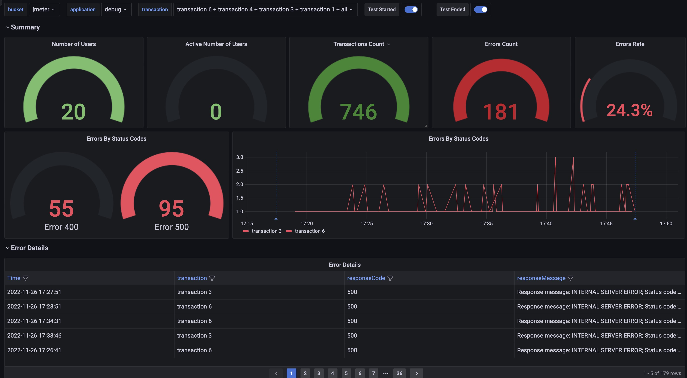
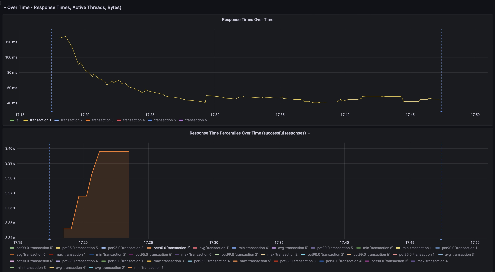
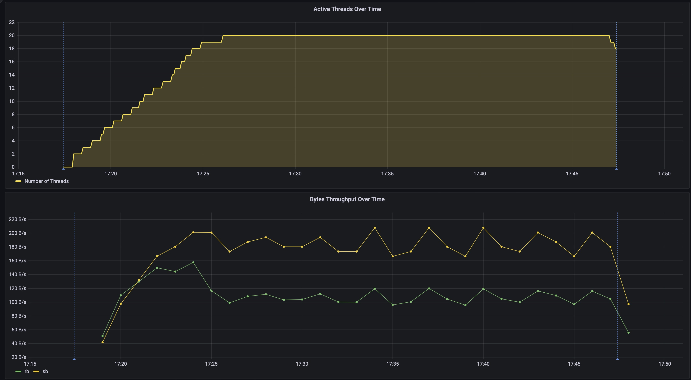
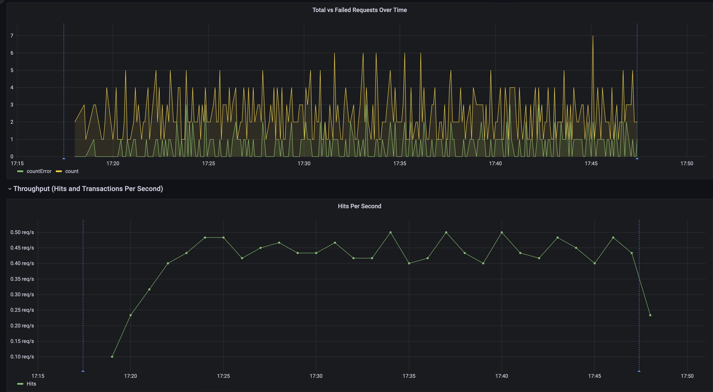
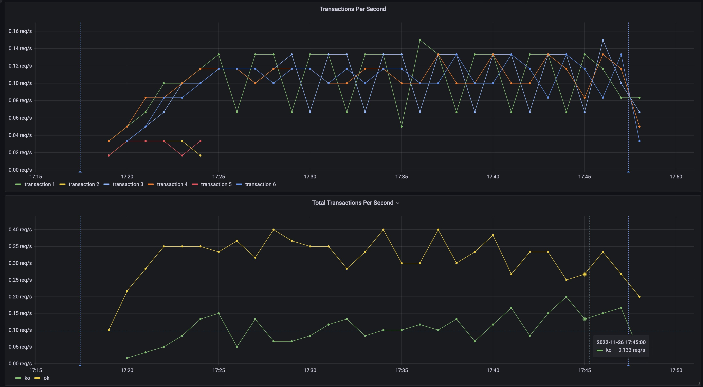

# Grafana dashboard to view the realtime JMeter performance test results

## TLDR

1. Add a JSR223 Listener to your jmx and paste the [code](<https://gist.github.com/fgeorge/07432d6e2c25d40128a1234da845adb2>).
2. Add a Backend Listener `org.apache.jmeter.visualizers.backend.influxdb.InfluxdbBackendListenerClient` to your jmx.
3. Import the [Grafana dashboard json](JMeter_Performance_Testing_Dashboard.json).

## Background

When running performance tests using [Apache JMeter](<https://jmeter.apache.org/>), to view the realtime test results and metrics we need to set up a backend listener that reports data to a timeseries db such as InfluxDB and then build a dashboard in Grafana/Influx etc. based on that data. There are lot of dashboards available in Grafana community. But with the newer versions of InfluxDB, Flux is us used as an alternative to InfluxQL language for querying and analyzing data. Unfortunately, most of the community provided dashboards are still using InfluxQL and there is no easy migration of the queries to the new Flux syntax. So, this is an attempt to build a Grafana dashboard using Flux as the query language for InfluxDB.

The Grafana dashboard will have the following metrics displayed.

- **Number of Users**, the count of total threads
- **Active Number of Users**, the count of active threads
- **Transactions Count**
- **Errors Count**
- **Errors Rate**
- **Errors By Status Codes**
- **Errors By Transaction**
- **Error Details**, for failed transactions view the respose code and response message
    > Will need to add a JSR223 Listener to your JMeter script to capture the error details; see the Step #8 in Setup for more details
- **Response Times Over Time**
- **Response Time Percentiles Over Time**, view the percentiles configured in the listener, defaults to 99,95&90
- **Active Threads Over Time**
- **Bytes Throughput Over Time**, bytes sent and received
- **Total vs Failed Requests Over Time**
- **Hits Per Second**
- **Transactions Per Second**
- **Average Response Times per transaction**, a repeat panel which will show the average response times for the transactions selected in the dropdown at the top of the dashboard


## Setup

1. Install [InfluxDB](<https://docs.influxdata.com/influxdb/v2.5/install/>).
2. Setup a bucket for JMeter metrics collection.
3. Create an API Token which can read and write data to the above bucket.
4. Install [Grafana](<https://grafana.com/docs/grafana/latest/setup-grafana/installation/>).
5. Setup a datasource in Grafana, by providing influxdb url, organization and API Token (from Step3).
6. Download the [Grafana dashboard json](JMeter_Performance_Testing_Dashboard.json) to Grafana->Dashboards->New->Import->Upload JSON File
7. In your JMeter Script, Add->Listener->Backend Listener at the Test Plan level.
    1. Select the value `org.apache.jmeter.visualizers.backend.influxdb.InfluxdbBackendListenerClient` for Backend Listener Implementation.
    2. Update the value of `influxdbUrl` parameter to `<url>/api/v2/write?org=<org>&bucket=<bucket>` and update the url, org and bucket for your influxdb setup.
    3. Add a parameter `influxdbToken` and provide the API Token for influxdb.
        
8. When running performance tests from JMeter CLI with fairly large number of users, we might need to see the respose details for failed requests. In order to do the same, please add a JSR223 Listener (insert it before the backend listener in JMeter tree) and add the below code to it. This script was riginally written by
[Anton Serputko](<https://github.com/serputko>); All credit goes to him, I have just modified his original script to remove `\r` characters because it looks like influxdb 2.x doesn't like those characters for write.

```groovy
/*
 Copyright © 2017-2018 Anton Serputko. Contacts: serputko.a@gmail.com
   
 Licensed under the Apache License, Version 2.0 (the "License");
 you may not use this file except in compliance with the License.
 You may obtain a copy of the License at

 http://www.apache.org/licenses/LICENSE-2.0

 Unless required by applicable law or agreed to in writing, software
 distributed under the License is distributed on an "AS IS" BASIS,
 WITHOUT WARRANTIES OR CONDITIONS OF ANY KIND, either express or implied.
 See the License for the specific language governing permissions and
 limitations under the License.
*/

import org.apache.jmeter.samplers.SampleResult;
import org.apache.jmeter.assertions.AssertionResult;

/*
 Set response message and send it to influxdb
 Write detailed error responses to jmeter log
*/ 

def transactionController = sampler.getThreadContext().getPreviousResult().getParent();

/*
 Check if previous failed sampler has parent and parent does not have sampler data. That means that parent is transaction controller.
*/
if(!sampleResult.isSuccessful()){
 if(transactionController && !transactionController.getSamplerData()){
  handleParentTransactionController(transactionController);
 }else if(sampleResult.getSamplerData()){
  handleSampler(sampleResult);
 } 
}

/*
 Change responseMessage for all sub samplers of Transaction controller and set them to Transaction controller response message
 Post all sub samplers trace to log
*/
def handleParentTransactionController(SampleResult transactionSampleResult) {
 def transactionResponseMessage = " "+transactionSampleResult.getResponseMessage()+" ";
 def subResults = transactionSampleResult.getSubResults();
 def assertions;
 if(subResults){
  for (int i=0; i<subResults.length; i++){
   if(!subResults[i].isSuccessful()){
    assertions = subResults[i].getAssertionResults();
    updateSampleResponseMessage(subResults[i], assertions);
    transactionResponseMessage = transactionResponseMessage+subResults[i].getSampleLabel()+"; "+subResults[i].getResponseMessage();
    postTraceToLog(subResults[i], assertions);
   }
  }
//   transactionSampleResult.setResponseMessage(transactionResponseMessage.replaceAll(" ", " "));            
 }
}

/*
 Change responseMessage for sampler and post trace to log
*/
def handleSampler(SampleResult sampleResult) {
 def assertions = sampleResult.getAssertionResults();
  updateSampleResponseMessage(sampleResult, assertions);
//  sampleResult.setResponseMessage(sampleResult.getResponseMessage().replaceAll(" ", " "));
  postTraceToLog(sampleResult, assertions);
}

def updateSampleResponseMessage(SampleResult sampleResult, AssertionResult[] assertions) {
 def responseMessage = sampleResult.getResponseMessage();
 sampleResult.setResponseMessage("Response message: "+sampleResult.getResponseMessage()+";"+" Status code: "+sampleResult.getResponseCode()+
  ";"+" Number of failed assertions: "+assertions.length+" "+generateResponseTrace(sampleResult)+" "+generateAssertionTrace(assertions))+";";
}

def generateResponseTrace(SampleResult sample) {
 def sampleResult = sample;
 def responseLogMessage = " "+
  "Sample Failed: "+sampleResult.toString()+" "+
  "Started at: "+new Date(sampleResult.getStartTime())+" "+
  "Finished at: "+new Date(sampleResult.getEndTime())+" "+
  "Request: "+
  sampleResult.getSamplerData()+" "+
  "REQUEST DATA "+
  "URL: "+
  sampleResult.getUrlAsString()+" "+
  "Request headers:  "+
  sampleResult.getRequestHeaders()+" "+
  "Response:  " +
  sampleResult.getResponseMessage()+" "+
  "Response code:" + sampleResult.getResponseCode()+" "+
  "Response data: "+
  sampleResult.getResponseDataAsString()+" ";
 return responseLogMessage;
}

/*
 Generate log trace for all failed assertions of sampler
*/
def generateAssertionTrace(AssertionResult[] assertions) {
 def assertionLogMessage = "";
 
 assertionLogMessage = "Assertion results: " +
 "Number of failed assertions: "+assertions.length+" "+assertionLogMessage;
 if(assertions.length>0){
  for(int j=0; j<assertions.length; j++){
   assertionLogMessage = assertionLogMessage + assertions[j].getName() + " Failed;  " + 
   "Failure Message: " + assertions[j].getFailureMessage()+"; "
  }
 }
 return assertionLogMessage+" "
}

def postTraceToLog(SampleResult sample, AssertionResult[] assertions) {
 print(generateResponseTrace(sample)+" "+generateAssertionTrace(assertions));
 }
```

## Screenshots

<pre >
<details>
  
  
  
  
  
</details>
</pre>
